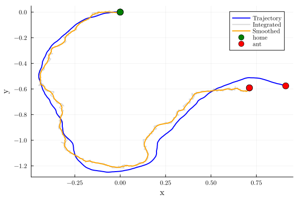

# path-integration-for-ants

Project for the course `Computational Neuroscience: Neuronal Dynamics` taught by Wulfram Gerstner at EPFL during the spring 2024 semester.

It consists of modelling the path integration mechanism in ants using bump attractors in ring neural network models.

Here is a [link to the report](./report_code/report.pdf).

